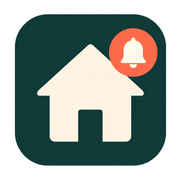

<p align="center">
  
</p>

# Smart Notify

Send Home Assistant notifications to the people who should actually get them, based on
who's home, who's away, or who's closest.

Use one `smart_notify.send` call in your automations instead of wiring up separate
notify actions for each person.

## Install

You need [HACS](https://hacs.xyz/docs/setup/download) first.

1. Open **HACS** → **Integrations**
2. Click the **⋮** menu (top right) → **Custom repositories**
3. Add `https://github.com/danroc/smart-notify` and pick **Integration** as the category
4. Click **Add**
5. Back in Integrations, search for **Smart Notify**, open it, and click **Download**
6. Restart Home Assistant

## Setup

1. Go to **Settings** → **Devices & services** → **Add integration**
2. Search for **Smart Notify**
3. Pick the `person` entities you want to include
4. Map each person to their mobile app notify service (for example
   `notify.mobile_app_pixel_7`)
5. Set your defaults (strategy, queue expiry, and so on)

You can change these later under the integration's **Configure** and **Options**.

## Send a notification

Call the service from an automation or script:

```yaml
service: smart_notify.send
data:
  title: Laundry
  message: Washing machine finished.
  strategy: arrival
  persons:
    - person.daniel
  expire_after: "4h"
```

`persons` is optional. Leave it out to use everyone configured in the integration.

### Strategies

| Strategy  | Who gets notified                                       | If nobody matches                   |
| --------- | ------------------------------------------------------- | ----------------------------------- |
| `direct`  | Everyone eligible                                       | Dropped                             |
| `home`    | People at home right now                                | Dropped                             |
| `away`    | People away right now                                   | Dropped                             |
| `closest` | People within `tolerance` of whoever is closest to home | Queued until someone has a location |
| `arrival` | People at home right now                                | Queued until someone arrives home   |

Queued notifications retry when someone enters the home zone. The `away` strategy does
not wait for someone to leave. If nobody is away, the notification is dropped.

Override the integration defaults per call with `strategy`, `tolerance`, and
`expire_after`.

### Action buttons

Works with the [Home Assistant Companion app](https://companion.home-assistant.io/). On
iOS, long-press the notification to see the buttons.

```yaml
service: smart_notify.send
data:
  title: Laundry
  message: Washing machine finished.
  strategy: arrival
  tag: laundry
  actions:
    - action: LAUNDRY_ACK
      title: Got it
    - action: LAUNDRY_SNOOZE
      title: Remind in 1 hour
```

Handle button taps in a `mobile_app_notification_action` automation. See the
[actionable notifications docs](https://companion.home-assistant.io/docs/notifications/actionable-notifications/).

### Other mobile app fields

`level`, `tag`, `group`, `image`, and `url` are supported as top-level service fields:

```yaml
service: smart_notify.send
data:
  title: Laundry
  message: Washing machine finished.
  strategy: arrival
  level: normal
  tag: laundry
  group: appliances
  url: /lovelace/laundry
```

## Development

Requires [uv](https://docs.astral.sh/uv/) and Python 3.13.2+ (Home Assistant 2026.x).

```bash
uv sync
uv run ruff check .
uv run ruff format --check .
uv run ty check
uv run pytest
```
